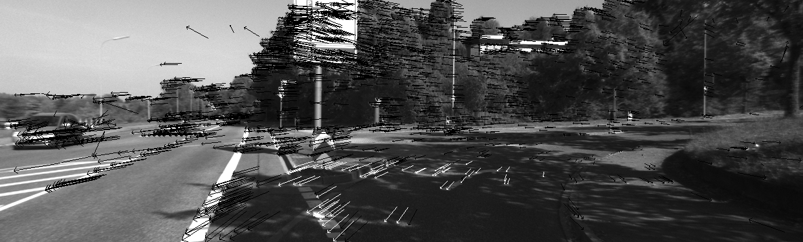

# VOPy-Teaser
## Calculate visual odometry on the KITTI dataset
Calculates the Visual Odometry on the KITTI Dataset using sparse features and a combination of RANSAC, 5-Points-Algorithm and Nonlinear Least Square minimisation of the epipolar error.
Most important features:

* Mono-camera odometry with Python
* Only the current and the previous frames are used
* Jacobian matrix defined in the state space and not in the tangent space

This approach is not anymore state-of-the-art - rather a nice math excercise. Neverthless, it can be used as a baseline-implementation to measure the performace of other, more modern approaches.

Sparse flow vectors. This approach tolerates a large number of outliers. In white: inlier optical flow vector in the pre-defined road region.

Estimated trajectory and ground-truth.
